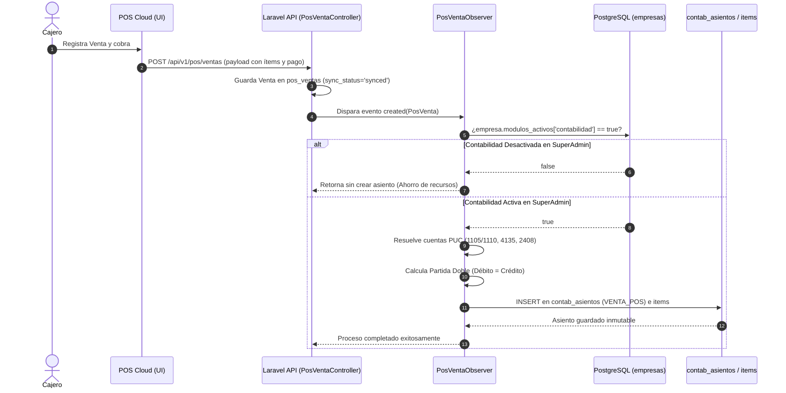

# Arquitectura de Contabilidad Electrónica & Integración POS Cloud

> **Documento Oficial de Especificación Contable (MindSoftia)**  
> **Fecha:** 2026-07-22  
> **Especialidad:** `master-cont` (en coordinación con `master-db` y `master-dev`)  
> **Estado:** Aprobado / En Implementación  

---

## 1. Resumen Ejecutivo & Visión del Módulo

El Módulo de **Contabilidad Electrónica** de MindSoftia opera bajo la premisa de **Automatización Cero Intervención**: el empresario o cajero opera su Punto de Venta (`POS CLOUD`) de manera intuitiva (como Dataico o una registradora simple), mientras en segundo plano el **Motor Contable Invisible (`PosVentaObserver`)** asienta cada transacción en el Plan Único de Cuentas (PUC) con la profundidad y rigor de Helisa/Siigo, garantizando cumplimiento NIIF y exigencias de los Libros Oficiales de la DIAN.

---

## 2. Estado Actual de la Base de Datos (`master-db`)

El sistema cuenta con las bases estructurales en PostgreSQL/Supabase:

1. **`empresas.modulos_activos` (JSONB):**
   Almacena el estado de activación de las funcionalidades por inquilino.  
   Ejemplo de estructura JSONB en BD:
   ```json
   {
     "pos": true,
     "contabilidad": true,
     "facturacion_electronica": false,
     "nomina_electronica": false
   }
   ```
2. **`accounts` (PUC - Plan Único de Cuentas):**
   Catálogo jerárquico (`clase`, `grupo`, `cuenta`, `subcuenta`, `auxiliar`) multi-tenant por `empresa_id` y código (`code`).
3. **`contab_asientos` y `contab_asientos_items` (Partida Doble):**
   Cabecera e ítems del Libro Diario. El modelo Eloquent (`ContabAsiento.php`) blinda por código la **inmutabilidad** (ningún monto ni fecha puede modificarse o eliminarse tras crearse; solo notas o reversiones).

---

## 3. Brechas Identificadas & Hoja de Ruta Contable (`master-cont` + `master-dev`)

Para que la Contabilidad Electrónica sea un módulo SaaS dinámico, robusto y apto para fiscalización DIAN antes de activar la Facturación Electrónica UBL 2.1, debemos implementar las siguientes 4 optimizaciones de arquitectura:

### ⚡ 3.1. Control del Toggle SaaS (`modulos_activos`) en `PosVentaObserver`
Actualmente, `PosVentaObserver::created()` intenta generar el asiento siempre que la venta del POS está en `sync_status = 'synced'`.
- **Regla de Negocio:** Si el SuperAdmin no ha activado el módulo de contabilidad para esa empresa (`modulos_activos->contabilidad == false`), el sistema **NO debe generar asientos en el PUC**.
- **Solución Técnica:** Modificar el inicio del `PosVentaObserver` para verificar:
  ```php
  $empresa = $venta->empresa; // o vía caché de tenant
  $modulos = is_string($empresa->modulos_activos) ? json_decode($empresa->modulos_activos, true) : $empresa->modulos_activos;
  if (empty($modulos['contabilidad']) || $modulos['contabilidad'] !== true) {
      return; // El módulo de contabilidad electrónica está desactivado para esta empresa
  }
  ```

### 🔗 3.2. Mapeo Dinámico de Cuentas PUC (Adiós al Hardcode de `config/pos.php`)
Actualmente, el observer busca la cuenta de caja en un archivo estático (`Config::get('pos.cuenta_caja', '1105')`).
- **Regla de Negocio:** Cada empresa en MindSoftia puede personalizar su PUC de 6 u 8 dígitos (ej. `11050501 Caja General Sede Norte`).
- **Solución Técnica:** El sistema debe consultar la tabla `accounts` del tenant para resolver las cuentas maestras o permitir que al crear la caja/sede en el POS se asocie la subcuenta contable específica (`cajas.cuenta_puc_id`).

### ⚖️ 3.3. Asiento Complementario: Costo de lo Vendido e Inventario (NIIF Permanente)
Actualmente el `PosVentaObserver` solo asienta el **Ingreso por Venta**:
- Débito: `1105` (Caja) / `1110` (Bancos) por `$Total`
- Crédito: `4135` (Comercio al por menor) por `$Base`
- Crédito: `2408` (IVA por pagar) por `$IVA`

- **Regla de Negocio NIIF (Sistema de Inventario Permanente):** Cada venta que descarga stock del Kardex (`inv_kardex`) debe generar simultáneamente el asiento del costo para que el Margen Bruto sea real:
  - **Débito:** `6135` (Costo de ventas de mercancías) por el `$Costo_Total_Kardex`
  - **Crédito:** `1435` (Mercancías no fabricadas por la empresa / Inventarios) por el `$Costo_Total_Kardex`

### 📊 3.4. Motor de Balances y Libros Oficiales Electrónicos DIAN
Para cumplir con la Contabilidad Electrónica fiscalizable, la base de datos debe permitir consultar con alta velocidad:
1. **Libro Diario Electrónico:** Consulta cronológica de `contab_asientos` por periodo (`YYYY-MM`).
2. **Libro Mayor y Balances (Balance de Prueba):** Resumen por cuenta PUC que muestre:
   $$\text{Saldo Anterior} + \sum \text{Débitos Periodo} - \sum \text{Créditos Periodo} = \text{Nuevo Saldo}$$
   *(Se sugiere crear la tabla de saldos mensuales `contab_saldos_periodo` para indexar y evitar escaneos pesados de millones de transacciones).*

---

## 4. Diagrama de Flujo del Ecosistema POS ➔ Contabilidad Electrónica



---

## 5. Próximos Pasos Recomendados para Ejecución (ESTADO: ✅ 100% COMPLETADOS)

1. [x] **Crear migración y modelo de saldos por periodo (`contab_saldos_periodo`)** para generar balances instantáneos en la interfaz del contador (`master-db` + `master-sec`). *(Ejecutado con `php artisan migrate` el 2026-07-22)*.
2. [x] **Añadir el Asiento del Costo de Ventas NIIF (`6135` vs `1435`)** conectando los detalles y el costo promedio del producto con el observer (`master-cont` + `master-dev`).
3. [x] **Refactorizar `PosVentaObserver.php`** incluyendo la validación del toggle SaaS (`modulo_contabilidad === true`), la partida doble completa y el cálculo en tiempo real de saldos (`master-dev`).
