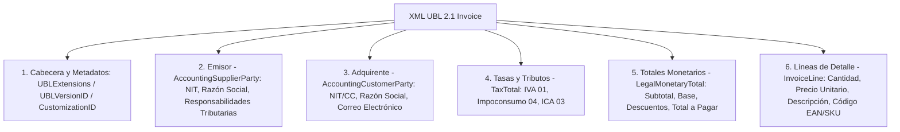
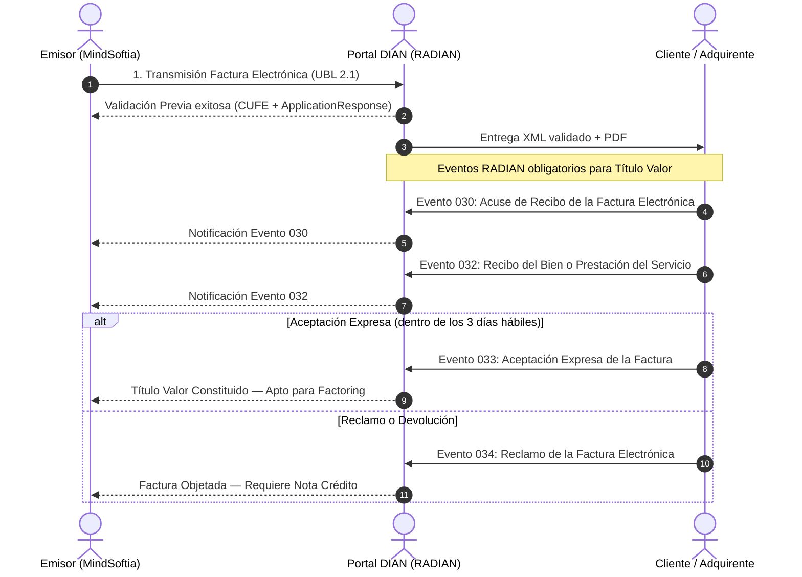

# Arquitectura e Ingeniería Tributaria: Facturación Electrónica DIAN (`UBL 2.1 / CUFE / RADIAN`)

**Módulo:** Facturación Electrónica, Nómina Electrónica y Eventos RADIAN de MindSoftia  
**Especialidades Actuantes:** `/master-cont` (Estrategia Tributaria & NIIF), `/master-db` (Modelado Relacional & Supabase), `/master-sec` (Aislamiento Multi-Tenant & Zero Trust) y `/master-doc` (Documentación Institucional).  
**Fecha de Emisión:** Julio 2026  
**Estado:** ✅ Documento Arquitectónico Maestro y Especificación Técnica DIAN  

---

## 1. Visión e Integración en el Ecosistema MindSoftia

La **Facturación Electrónica de Venta con Validación Previa (UBL 2.1)** y el registro de eventos **RADIAN** son obligaciones tributarias innegociables para las empresas colombianas ante la Dirección de Impuestos y Aduanas Nacionales (**DIAN**). 

En el ecosistema **MindSoftia**, este pilar no opera de forma aislada:
1. **Punto de Venta (`pos_ventas`) y Facturas Comerciales (`com_facturas`):** Sirven como fuente transaccional primaria (`documento_origen`).
2. **Motor Contable (`contab_asientos` y `contab_saldos_periodo`):** Recibe simultáneamente los impactos de ingresos, IVA por pagar y cuentas por cobrar o tesorería.
3. **Motor Electrónico (`fe_documentos`):** Genera el XML en formato estándar **UBL 2.1**, calcula el **CUFE (Código Único de Factura Electrónica)** mediante hash criptográfico SHA-384, firma digitalmente el certificado (`.p12`) y transmite al web service de la DIAN.

---

## 2. Estructura Estándar XML UBL 2.1 (Universal Business Language)

Todo documento fiscal (`Invoice`, `CreditNote`, `DebitNote`) generado en MindSoftia debe cumplir estrictamente el esquema del Anexo Técnico 1.8 de la DIAN, estructurado en 6 bloques obligatorios:



### Tabla de Códigos de Tributos DIAN (Tabla 13.2.1)
| Código DIAN | Nombre del Tributo | Naturaleza en MindSoftia (`accounts`) |
| :--- | :--- | :--- |
| `01` | IVA (Impuesto sobre las Ventas) | `2408` — IVA por pagar (19%, 5%, Exento, Excluido) |
| `02` | IC (Impuesto al Consumo) | `2495` / `2408` — Impoconsumo (8%, 4%) |
| `03` | ICA (Impuesto de Industria y Comercio) | `2368` — Retención y tributos municipales |
| `04` | INC (Impoconsumo Bolsas Plásticas) | `2495` — Impoconsumo bolsas |

---

## 3. Algoritmo Criptográfico de Generación del CUFE (SHA-384)

El **CUFE (Código Único de Factura Electrónica)** es la huella digital inmutable de 96 caracteres hexadecimales que autentica la factura ante la DIAN y los terceros.

### Fórmula Universal del CUFE SHA-384 (Anexo Técnico DIAN 1.8):
$$\text{CUFE} = \text{SHA-384}\Big( \text{NumFact} + \text{FecFact} + \text{HoraFact} + \text{ValFac} + \text{CodImp1} + \text{ValImp1} + \text{CodImp2} + \text{ValImp2} + \text{CodImp3} + \text{ValImp3} + \text{ValImp} + \text{ValTot} + \text{NitOFE} + \text{NumAdq} + \text{ClaveTecnica} + \text{TipoAmbiente} \Big)$$

### Parámetros Exactos Concatenados:
1. `NumFact`: Número de factura con prefijo (Ej: `SETP990000001`).
2. `FecFact`: Fecha de emisión en formato `YYYY-MM-DD` (Ej: `2026-07-22`).
3. `HoraFact`: Hora de emisión con huso horario `HH:mm:ss-05:00`.
4. `ValFac`: Valor total de la venta sin impuestos (Subtotal), con dos decimales y sin separador de miles (Ej: `100000.00`).
5. `CodImp1` + `ValImp1`: `01` + Valor total IVA (Ej: `01` + `19000.00`). Si no aplica IVA, se concatena `01` + `0.00`.
6. `CodImp2` + `ValImp2`: `04` + Valor total Impoconsumo (Ej: `04` + `0.00`).
7. `CodImp3` + `ValImp3`: `03` + Valor total ICA (Ej: `03` + `0.00`).
8. `ValImp`: Valor total de todos los impuestos sumados (Ej: `19000.00`).
9. `ValTot`: Valor total de la factura incluido impuestos (Ej: `119000.00`).
10. `NitOFE`: NIT del Obligado a Facturar Electrónicamente (Emisor, sin dígito de verificación).
11. `NumAdq`: Número de identificación del comprador (o `222222222222` si es consumidor final).
12. `ClaveTecnica`: Cadena alfanumérica secreta otorgada por la resolución DIAN al prefijo del emisor.
13. `TipoAmbiente`: `1` para Producción Oficial / `2` para Ambiente de Pruebas DIAN.

> [!IMPORTANT]
> **Seguridad y Trazabilidad (`master-sec`):** El CUFE y el código QR resultante deben guardarse inmediatamente en la tabla `fe_documentos` del tenant. Jamás deben recalcularse al vuelo durante una consulta histórica para evitar discrepancias si cambian los decimales de la base.

---

## 4. Eventos RADIAN (Registro de Títulos Valores)

Cuando una factura de venta se emite a **crédito** (plazo de pago > 0 días), el adquirente y el emisor deben intercambiar eventos electrónicos en el sistema **RADIAN** de la DIAN para que la factura adquiera mérito ejecutivo y pueda ser negociada en **Factoring** (descuento de facturas).



### Códigos y Descripción de los Eventos RADIAN en `fe_eventos_radian`:
- **`030` — Acuse de Recibo de Factura:** Confirma que el comprador recibió el archivo XML y el PDF.
- **`032` — Recibo del Bien y/o Servicio:** Confirma que la mercancía fue entregada a conformidad.
- **`033` — Aceptación Expresa:** El comprador acepta formalmente el cobro. Desde este segundo, la factura es un **Título Valor endosable**.
- **`034` — Reclamo / Rechazo:** El comprador objeta la factura por errores en precio, mercancía incompleta o vicios de calidad.

---

## 5. Diseño Relacional e Integración Multi-Tenant (`master-db` + `master-sec`)

El ecosistema tributario de MindSoftia se compone de 3 entidades centrales aisladas por empresa:

### A. `fe_resoluciones` (Resoluciones de Numeración DIAN)
Almacena los rangos autorizados y claves técnicas por sucursal o prefijo:
- `empresa_id` (BIGINT FK)
- `prefijo` (VARCHAR, ej: `SETP`, `FE`)
- `numero_inicial`, `numero_final` (BIGINT)
- `clave_tecnica` (VARCHAR 150)
- `ambiente` (`1` Producción, `2` Pruebas)
- `vigencia_desde`, `vigencia_hasta` (DATE)

### B. `fe_documentos` (Historial XML y Transmisiones DIAN)
Repositorio central de todo documento electrónico (`Invoice`, `CreditNote`, `DebitNote`):
- `empresa_id` (BIGINT FK)
- `tipo_documento` (`01` Factura Venta, `03` Nota Débito, `04` Nota Crédito, `05` POS Electrónico, `10` Nómina CUNE)
- `documento_origen_tipo` (`pos_venta`, `com_factura`), `documento_origen_id` (UUID FK)
- `prefijo`, `consecutivo`, `numero_completo`
- `cufe_cune` (VARCHAR 96 SHA-384)
- `qr_code_url` (TEXT)
- `xml_generado`, `xml_firmado` (TEXT)
- `track_id_dian` (VARCHAR 100) — Identificador de seguimiento devuelto por el web service DIAN.
- `estado_dian` (Enum: `borrador`, `enviado`, `aprobado`, `rechazado`, `anulado`)

### C. `fe_eventos_radian` (Títulos Valores y Trazabilidad)
Registro de acusaciones y aceptaciones:
- `fe_documento_id` (UUID FK -> `fe_documentos.id`)
- `empresa_id` (BIGINT FK)
- `codigo_evento` (`030`, `032`, `033`, `034`)
- `descripcion_evento` (VARCHAR)
- `track_id_dian`, `xml_evento`

---

## 6. Políticas de Seguridad Zero Trust y RLS (`master-sec`)

Cada una de las tablas de facturación electrónica cuenta con **Row Level Security (RLS)** habilitado y restringido estrictamente al `tenant_id` del JWT del usuario logueado en Supabase:

```sql
ALTER TABLE public.fe_documentos ENABLE ROW LEVEL SECURITY;
CREATE POLICY "Aislamiento Empresa Documentos DIAN" ON public.fe_documentos
    FOR ALL USING (empresa_id = (nullif(current_setting('request.jwt.claims', true), '')::jsonb ->> 'tenant_id')::BIGINT);
```

Este blindaje garantiza que una entidad no pueda interceptar, consultar ni descargar los XML o CUFEs confidenciales de otro inquilino del SaaS MindSoftia bajo ninguna circunstancia.
