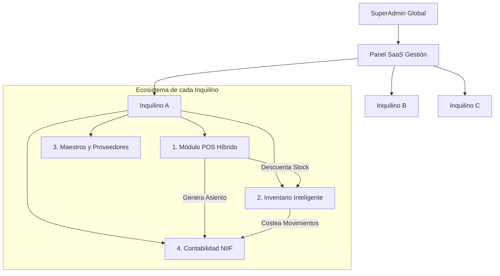

# Arquitectura Tecnológica y Modelo SaaS de Mindsoftia

Este documento centraliza la filosofía arquitectónica del proyecto, explicando el rol de cada tecnología y el diseño estructural del software como servicio (SaaS).

---

## 1. Stack Tecnológico: ¿Qué usamos y por qué?

### ⚛️ Frontend: React.js (Vite)
- **¿Qué hace?**: Es la capa visual e interactiva con la que interactúa el usuario final (Cajeros, Supervisores, SuperAdmins). Maneja los dashboards, el punto de venta (POS) y los formularios.
- **¿Por qué lo usamos?**: Permite crear Single Page Applications (SPA) ultrarrápidas, donde la página no necesita recargarse cada vez que se hace clic. A través de la persistencia local (ej. IndexedDB / Dexie.js), logramos construir un **Punto de Venta Offline-First** que reacciona en milisegundos.

### 🐘 Backend Lógico: Laravel (PHP)
- **¿Qué hace?**: Actúa como el "cerebro orquestador" y el motor de lógica de negocios pesada. Calcula impuestos, genera los Asientos Contables (partida doble) automáticamente tras una venta, gestiona integraciones con APIs externas (como la DIAN) y estructura de forma ordenada (mediante *Middlewares* y *Controllers*) la respuesta que necesita el Frontend.
- **Relación con Supabase**: Laravel no gestiona la base de datos localmente. Se conecta remotamente a la base de datos PostgreSQL alojada en Supabase para ejecutar sus migraciones (creación de tablas) y consultas (vía Eloquent ORM).

### ⚡ Base de Datos e Infraestructura: Supabase (PostgreSQL)
- **¿Qué hace?**: Es el servicio de infraestructura en la nube que nos provee una base de datos PostgreSQL robusta, almacenamiento de archivos (Storage), autenticación, y políticas de seguridad a nivel de fila (RLS).
- **¿Por qué lo usamos?**: Al ser un SaaS multi-tenant (muchas empresas compartiendo la misma base de datos), PostgreSQL nos brinda la solidez transaccional y Supabase nos regala las políticas RLS para asegurar matemáticamente que la Empresa A jamás pueda ver los datos de la Empresa B.

---

## 2. Flujo de Autenticación: ¿Quién manda?

La autenticación en Mindsoftia utiliza una arquitectura **Híbrida Criptográfica**:

1. **Supabase (GoTrue)** es el dueño de la identidad. Cuando un usuario inicia sesión, Supabase emite un **JWT (JSON Web Token) asimétrico**.
2. **React** recibe ese token y lo almacena localmente para mantener la sesión viva.
3. **Laravel** (Backend) recibe este JWT en los headers HTTP (`Authorization: Bearer <token>`). A través de un puente criptográfico (Middlewares configurados para ES256/RS256), Laravel verifica la firma digital del token contra las llaves públicas de Supabase.
4. **Resumen**: Supabase emite el pase de seguridad, y Laravel actúa como el guardia en la puerta validando que el pase sea genuino antes de dejar pasar a leer o escribir datos contables.

---

## 3. Modelo SaaS y Arquitectura de Módulos

Mindsoftia opera bajo un modelo Multi-Tenant. Un único ecosistema de código y base de datos sirve a múltiples organizaciones aisladas entre sí.

### Esquema Conceptual de Módulos

### Descripción de los Módulos Fundamentales:

1. **SuperAdmin (Backoffice)**: Donde se registran las empresas, se manejan suscripciones y se encienden/apagan módulos por cliente.
2. **CRM / Terceros**: Repositorio único de Clientes, Proveedores y Empleados (NIT/Cédula).
3. **Punto de Venta (POS) Híbrido**: Interfaz de cobro rápido offline-first que sincroniza facturas al backend en background.
4. **Inventario / Kardex**: Motor transaccional que asegura precisión en las existencias, multi-bodega y costeo de inventarios.
5. **Contabilidad NIIF**: El Plan Único de Cuentas (PUC) automatizado. Captura pasivamente las ventas del POS y las compras del inventario para armar el Libro Diario y balances sin intervención humana.
