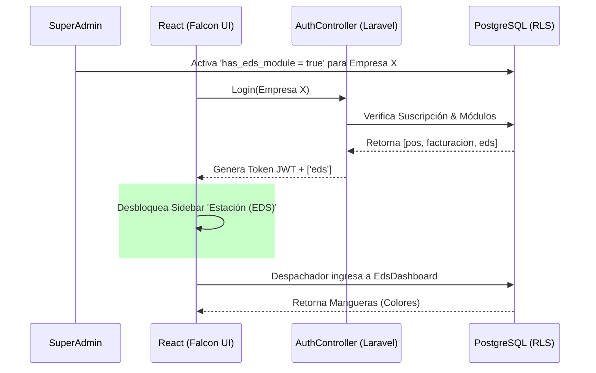

# Flujo de Trabajo: Módulo Estación de Servicio (EDS)
**Fechas de Ejecución:** Julio 27 al 30 de 2026.
**Alcance:** Orquestación Multi-Agente (Contabilidad, Base de Datos, Backend y Frontend).

> [!IMPORTANT]
> Este documento centraliza las decisiones arquitectónicas y el flujo de construcción del Módulo EDS. Debe usarse como referencia de inducción para nuevos ingenieros (Technical Onboarding) al momento de escalar módulos industriales en MindSoftia.

## 1. Contexto Estratégico (Día 27: Análisis y Mapping)
El requerimiento inicial demandaba un sistema capaz de manejar volumetría (inventario en galones/litros) y turnos rápidos bajo el sol.

### ¿Qué se hizo?
- Redacción del `analisis_modulo_eds_generico.md`.
- Unificación del mapeo de datos entre el inventario estándar (unidades) y el inventario volumétrico continuo.
### ¿Por qué?
- Porque desarrollar un sistema estricto solo para "gasolineras" limitaría el espectro comercial.
### ¿Para qué?
- Para comercializar MindSoftia SaaS en ferreterías industriales (venta por m³) y distribuidoras de químicos, justificando el costo de desarrollo del módulo Premium.

---

## 2. Persistencia y Aislamiento (Día 28: Base de Datos)
El módulo EDS es altamente transaccional. La información de las islas, mangueras y despachos no puede cruzarse bajo ninguna circunstancia.

### ¿Qué se hizo?
- Creación de 5 modelos de dominio Eloquent: `EdsIsla`, `EdsSurtidor`, `EdsManguera`, `EdsTurno`, `EdsLectura`.
- Inyección del trait `Multitenantable` (Global Scope) a cada modelo.
- Construcción del `EdsController`.
### ¿Por qué?
- Porque los operarios (isleros) cometen errores. El backend debía tener validaciones pesadas (ej. no abrir dos turnos simultáneos) antes de tocar la base de datos.
### ¿Para qué?
- Para garantizar que la lógica de negocio (el cerebro) filtre la data antes de integrarse con el motor contable NIIF y la posterior Facturación Electrónica DIAN.

---

## 3. Orquestación Autónoma (Día 29: Skills IA)
El desarrollo requería velocidad y precisión técnica que un solo desarrollador tardaría semanas en orquestar.

### ¿Qué se hizo?
- Se crearon los **Skills Autónomos**: `master-cont`, `master-ui`, `master-dev`, `master-db`.
- Se inyectó el toggle del Módulo EDS en el formulario de creación de empresas del SuperAdmin (`Tenants.jsx`).
### ¿Por qué?
- El ecosistema Falcon UI tiene reglas estrictas (Cero CSS Custom) y la DIAN exige formatos UBL 2.1; delegar estos frentes a agentes IA pre-entrenados aseguró cumplimiento normativo inmediato.
### ¿Para qué?
- Para automatizar la refactorización y permitir que MindSoftia escale funcionalidades financieras a una velocidad 4x.

---

## 4. Experiencia de Usuario Táctil (Día 30: Frontend Operativo)
El reto final fue la vista del operario. Una pantalla de PC tradicional no sirve en una isla de gasolina.

### ¿Qué se hizo?
- Maquetación del `EdsDashboard.jsx` utilizando botones masivos (`btn-lg`, `fs-1`).
- Corrección profunda del árbol de permisos en `authStore.js` y `AuthController.php` (inyectando la variable `eds` al perfil JWT).
- Inserción condicional en el `Sidebar.jsx`.

### ¿Por qué?
- **UI:** Los despachadores usan tablets bajo el sol, con dedos manchados de aceite. Necesitaban colores llamativos (Rojo=Corriente, Azul=Extra) y botones que no tuvieran el retraso de 300ms de los móviles (`touchAction: manipulation`).
- **Seguridad:** El backend no estaba enviando la autorización del módulo al iniciar sesión, dejando la vista oculta e inaccesible.

### ¿Para qué?
- Para garantizar un flujo de despacho ininterrumpido (UX premium) y asegurar que solo las empresas que pagan por el módulo EDS puedan siquiera ver que existe en su barra lateral.

---

## Diagrama de Interacción Funcional (EDS)

> [!TIP]
> **Extensibilidad:** Para agregar un nuevo tipo de combustible en el futuro, no se debe alterar el frontend. Simplemente se añade el registro en la tabla `eds_mangueras` y el `EdsDashboard.jsx` lo renderizará basándose en el color HEX almacenado en la BD.
