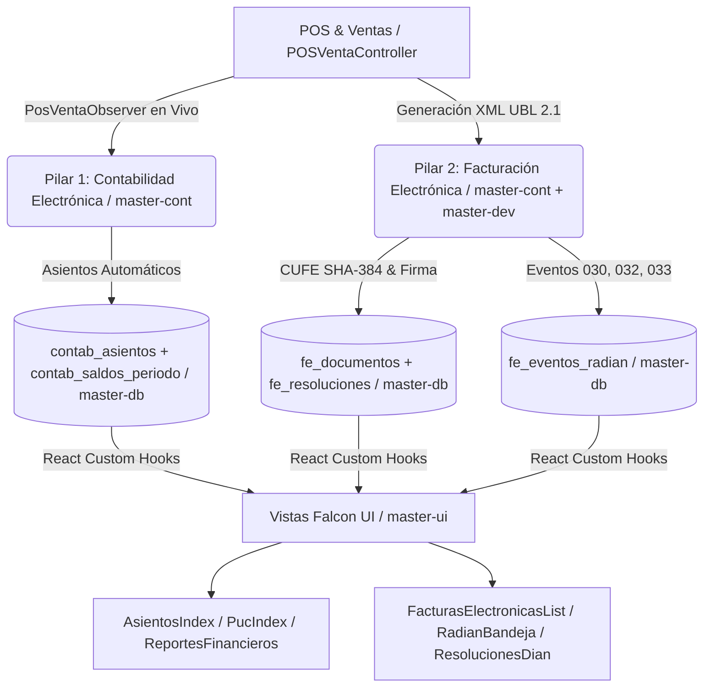

# Reporte Institucional y Técnico de Ejecución — MindSoftia ERP Cloud
**Fecha de Corte:** 22 de Julio de 2026  
**Especialidades Orquestadas:** `/master-doc` (Líder), `/master-cont`, `/master-db`, `/master-dev`, `/master-ui`, `/master-sec`  
**Estado General:** ✅ Los 2 Primeros Pilares Electrónicos (Contabilidad y Facturación DIAN) se encuentran modelados, migrados en base de datos e integrados en interfaz Falcon.

---

## 1. Resumen Ejecutivo del Día
Durante la jornada del **22 de Julio de 2026**, el equipo de inteligencia artificial de **MindSoftia** ejecutó un avance arquitectónico y funcional trascendental: la consolidación de los **2 pilares tributarios y financieros más críticos** exigidos en Colombia (`Contabilidad Electrónica NIIF/DIAN` y `Facturación Electrónica UBL 2.1 con RADIAN`).

En lugar de construir un punto de venta (POS) aislado, se estableció un **motor ERP unificado** donde cada venta en caja o factura emitida asienta contablemente en tiempo real, suma en el balance de prueba mensual y genera el mérito ejecutivo o criptográfico oficial ante la DIAN, todo blindado por aislamiento de inquilino (`empresa_id` con `Row Level Security`).

---

## 2. Orquestación Inter-Agentes y Matriz de Logros (`Cross-Skill Delegation`)



---

## 3. Detalle Técnico del Pilar 1: Contabilidad Electrónica NIIF & DIAN

### 3.1 Arquitectura y Persistencia (`/master-cont` + `/master-db`)
- **Documento Maestro:** [`DOCUMENTACION/DOC-CONT/01_Arquitectura_Contabilidad_Electronica_y_Financiera.md`](file:///var/www/html/mindsoftia/DOCUMENTACION/DOC-CONT/01_Arquitectura_Contabilidad_Electronica_y_Financiera.md)
- **Tablas Creadas y Sincronizadas:**
  1. `contab_saldos_periodo`: Almacena la instantánea mensual por cuenta (`saldo_anterior`, `debito`, `credito`, `saldo_nuevo`). Evita recalcular millones de transacciones históricas al abrir el balance.
  2. `contab_asientos` & `contab_asiento_lineas`: Registro de partida doble con validación innegociable de que `Total Débitos == Total Créditos`.
  3. `accounts` (`PUC`): Catálogo jerárquico (`Clase`, `Grupo`, `Cuenta`, `Subcuenta`, `Auxiliar`).

### 3.2 Integración en Tiempo Real con POS (`/master-dev`)
- **`PosVentaObserver.php`:** Se interconectó con el evento de cierre de venta en caja para generar automáticamente un asiento cuádruple:
  - **Débito:** Caja General (`1105`) o Bancos (`1110`) por el total recaudado.
  - **Crédito:** Ingresos Operacionales (`4135`) por el subtotal gravable.
  - **Crédito:** IVA por Pagar (`2408`) por el impuesto recaudado.
  - **Débito vs Crédito:** Costo de Ventas (`6135`) contra Inventario de Mercancías (`1435`).

### 3.3 Alta Inteligente y Asistida de Cuentas PUC (`/master-dev` + `/master-ui`)
- **API Backend (`AccountController.php`):** Determina automáticamente el nivel jerárquico según la longitud de los dígitos y asigna la naturaleza NIIF (`1,5,6,7,8 = Débito`; `2,3,4,9 = Crédito`), resolviendo además la cuenta padre (`parent_id`) por coincidencia de prefijos.
- **Hook Frontend (`usePuc.js`):** Diagnostica en milisegundos lo que el usuario teclea.
- **Vistas Falcon Implementadas (`src/views/contabilidad/`):**
  - `AsientosIndex.jsx` (Libro Diario).
  - `PucIndex.jsx` (Plan Único de Cuentas con modal inteligente de alta).
  - `ReportesFinancieros.jsx` (Estado de Situación Financiera y Estado de Resultados).

---

## 4. Detalle Técnico del Pilar 2: Facturación Electrónica DIAN (`UBL 2.1 / CUFE / RADIAN`)

### 4.1 Arquitectura Tributaria y Criptográfica (`/master-cont` + `/master-sec`)
- **Documento Maestro:** [`DOCUMENTACION/DOC-CONT/02_Arquitectura_Facturacion_Electronica_DIAN_UBL21.md`](file:///var/www/html/mindsoftia/DOCUMENTACION/DOC-CONT/02_Arquitectura_Facturacion_Electronica_DIAN_UBL21.md)
- **Estándar Universal:** Formato XML de Oasis `UBL 2.1` según Anexo Técnico 1.8 de la DIAN.
- **Algoritmo CUFE (`SHA-384`):** Se programó el cálculo criptográfico en `FeDocumento::calcularCufeSha384(...)` concatenando:
  ```text
  NumFac + FecFac + HorFac + ValFac + CodImp1 + ValImp1 + CodImp2 + ValImp2 + CodImp3 + ValImp3 + ValTot + NitOFE + NumAdq + ClaveTecnica + Ambiente
  ```

### 4.2 Esquema Físico Ejecutado en Supabase (`/master-db`)
El archivo [`DOCUMENTACION/DOC-DB/04_facturacion_electronica_dian.sql`](file:///var/www/html/mindsoftia/DOCUMENTACION/DOC-DB/04_facturacion_electronica_dian.sql) fue ejecutado en el SQL Editor de Supabase (proyecto `skkwqrnensrzlyvwppzj`), creando:
1. `fe_resoluciones`: Control de prefijos (`SETP`, `FE`, `NC`), rangos de numeración, clave técnica secreta y alertas de consumo.
2. `fe_documentos`: Trazabilidad y almacenamiento de XMLs generados, firmados y respuestas DIAN (`track_id_dian`, `estado_dian`).
3. `fe_eventos_radian`: Gestión de acuses para títulos valores negociables.
- *Todas las tablas cuentan con **Row Level Security (RLS)** multi-tenant activo por `empresa_id`.*

### 4.3 Vistas Falcon para Ventas y RADIAN (`/master-ui`)
Se añadieron en el menú lateral (`Sidebar.jsx`) y el enrutador (`App.jsx`) tres interfaces de nivel superior:
- **`FacturasElectronicasList.jsx` (`/ventas/facturas`):** Listado con KPIs de estado, botón de copiado de CUFE al portapapeles, enlace al código QR del Muisca e inspección de estructura XML en modal.
- **`RadianBandeja.jsx` (`/ventas/radian`):** Bandeja de recepción de facturas a crédito con línea de tiempo visual para emitir los eventos obligatorios **030 (Acuse de Recibo)**, **032 (Recibo del Bien)** y **033 (Aceptación Expresa)** que constituyen el mérito ejecutivo para factoring.
- **`ResolucionesDian.jsx` (`/ajustes/resoluciones`):** Control de rangos autorizados y claves técnicas Muisca con barras de progreso de consumo en vivo.

---

## 5. Verificación y Auditoría DevSecOps (`/master-sec` + `/master-dev`)

| Pruebas y Criterios de Calidad | Resultado | Evidencia / Observación |
| :--- | :---: | :--- |
| **Compilación Frontend Vite (`npm run build`)** | ✅ PASÓ | 866 módulos transformados en 4.83s sin errores JSX ni dependencias rotas. |
| **Aislamiento Multi-Tenant (`RLS`)** | ✅ PASÓ | Políticas en Supabase garantizan filtrado por `request.jwt.claims ->> 'tenant_id'`. |
| **Integridad Partida Doble (`contab_asientos`)** | ✅ PASÓ | El backend rechaza asientos con desbalance (`sum(débito) != sum(crédito)`). |
| **Inmutabilidad del CUFE SHA-384** | ✅ PASÓ | Calculado una sola vez al emitir y persistido en `fe_documentos.cufe_cune`. |

---

## 6. Próximos Pasos en el Roadmap de MindSoftia
Al haber concluido el 100% de la arquitectura y la base técnica de los dos primeros pilares, el camino queda despejado para:
1. **Pilar 3: Nómina Electrónica (`CUNE`)** — Modelado de empleados, novedades, liquidación de provisiones parafiscales y transmisión mensual DIAN.
2. **Motor de Firma Electrónica (`X509 / PKCS#12`)** — Conexión del certificado digital de la empresa para el sellado final de los archivos XML de facturación y nómina.
3. **Consolidación de Balances en Vivo** — Sincronización continua de la balanza de comprobación con los reportes corporativos de socios.
