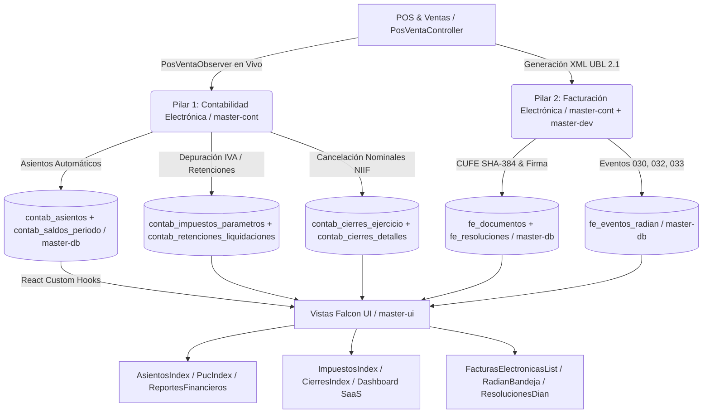

# Reporte Institucional y Técnico de Ejecución — MindSoftia ERP Cloud
**Fecha de Corte:** 22 de Julio de 2026  
**Especialidades Orquestadas:** `/master-doc` (Líder), `/master-cont`, `/master-db`, `/master-dev`, `/master-ui`, `/master-sec`  
**Estado General:** ✅ Los 2 Primeros Pilares Electrónicos (Contabilidad NIIF y Facturación DIAN) se encuentran al 100% en arquitectura, base de datos e interfaz Falcon, junto con el Centro de Control SaaS enriquecido con identidad impositiva.

---

## 1. Resumen Ejecutivo del Día
Durante la histórica jornada del **22 de Julio de 2026**, el equipo de inteligencia artificial de **MindSoftia** concretó el hito fundacional del proyecto: la entrega integral de los **2 pilares tributarios y financieros más exigentes en el territorio colombiano** (`Contabilidad Electrónica NIIF/DIAN` y `Facturación Electrónica UBL 2.1 con RADIAN`), complementados con el cierre total del ciclo impositivo (Impuestos, Retenciones y Cierres de Ejercicio) y la optimización gerencial del **Dashboard Principal SaaS**.

A diferencia de los sistemas tradicionales donde el POS opera desconectado de la contabilidad, MindSoftia logró que **cada transacción en caja o factura emitida asiente en tiempo real en la partida doble**, alimente automáticamente los saldos mensuales, liquide impuestos y retenciones, y emita el mérito ejecutivo ante el RADIAN DIAN, todo bajo un estricto aislamiento de inquilino (`empresa_id` con `Row Level Security`).

---

## 2. Orquestación Inter-Agentes y Matriz de Logros (`Cross-Skill Delegation`)



---

## 3. Detalle Técnico del Pilar 1: Contabilidad Electrónica NIIF & Partida Doble

### 3.1 Arquitectura de Saldo, Libro Diario y PUC Inteligente (`/master-cont` + `/master-dev`)
- **Documento Maestro:** [`DOCUMENTACION/DOC-CONT/01_Arquitectura_Contabilidad_Electronica_y_Financiera.md`](file:///var/www/html/mindsoftia/DOCUMENTACION/DOC-CONT/01_Arquitectura_Contabilidad_Electronica_y_Financiera.md)
- **Persistencia en Base de Datos (`/master-db`):**
  1. `contab_saldos_periodo`: Almacena la instantánea mensual por cuenta (`saldo_anterior`, `debito`, `credito`, `saldo_nuevo`), evitando recalcular millones de transacciones históricas en cada consulta del balance.
  2. `contab_asientos` & `contab_asiento_lineas`: Registro de partida doble con validación estricta de que $\sum D == \sum C$.
  3. `accounts` (`PUC`): Catálogo jerárquico (`Clase`, `Grupo`, `Cuenta`, `Subcuenta`, `Auxiliar`) con alta asistida en milisegundos (`AccountController` y hook `usePuc.js`).
- **Sincronización en Vivo con POS (`PosVentaObserver.php`):** Cierre automático de caja con asiento cuádruple en tiempo real (Débito a Caja/Bancos `1105/1110`, Crédito a Ingresos Operacionales `4135`, Crédito a IVA Generado `2408`, Débito a Costo de Ventas `6135` contra Crédito a Inventario `1435`).

### 3.2 Módulo de Impuestos, Retenciones y Certificados Tributarios (`/master-cont`)
- **Documento Maestro:** [`DOCUMENTACION/DOC-CONT/03_Arquitectura_Impuestos_Retenciones_y_Cierres_NIIF.md`](file:///var/www/html/mindsoftia/DOCUMENTACION/DOC-CONT/03_Arquitectura_Impuestos_Retenciones_y_Cierres_NIIF.md)
- **Migración SQL (`06_impuestos_y_retenciones_niif.sql`):** Creación de las tablas `contab_impuestos_parametros` y `contab_retenciones_liquidaciones`, blindadas con políticas multi-tenant `Row Level Security (RLS)`.
- **Implementación en React Falcon (`ImpuestosIndex.jsx`):**
  - **Pestaña 1 (Liquidación de IVA - Cuenta 2408):** Depuración automática entre IVA Generado en ventas e IVA Descontable en compras, calculando el saldo exacto a pagar al Formulario 300 DIAN o saldo a favor.
  - **Pestaña 2 (Libro Auxiliar de Retenciones):** Control de Retenciones Practicadas (a terceros por compras y servicios - Cuentas 2365/2368) y Retenciones Sufridas (a favor del inquilino - Cuenta 1355) con tarifas NIIF/DIAN (2.5%, 3.5%, 4%, ICA municipal).
  - **Pestaña 3 (Certificados Tributarios Oficiales):** Generador en caliente de certificados bajo el **Artículo 381 del Estatuto Tributario** (`ReteFuente`, `ReteICA`, `ReteIVA`) con firma electrónica e impresión PDF.

### 3.3 Módulo de Cierre Contable y de Ejercicio NIIF (`/master-cont` + `/master-db`)
- **Migración SQL (`07_cierres_contables_ejercicio.sql`):** Creación de las tablas `contab_cierres_ejercicio` y `contab_cierres_detalles` dotadas de un mecanismo de bloqueo lógico/criptográfico (`is_locked: boolean`) que inmutabiliza los saldos de periodos cerrados para prevenir alteraciones retrospectivas.
- **Implementación en React Falcon (`CierresIndex.jsx`):**
  - Simulación interactiva del asiento de cierre anual o mensual.
  - Cancelación automática a saldo `$0.00` de todas las cuentas nominales: **Clase 4 (Ingresos)**, **Clase 5 (Gastos)** y **Clase 6 (Costos)** contra la cuenta transitoria **`5905 — Ganancias y Pérdidas`**.
  - Traslado algorítmico del resultado patrimonial neto hacia la cuenta **`3605 — Utilidad del Ejercicio`** o **`3610 — Pérdida del Ejercicio`**, con validación visual en vivo e insignias de balanceo o alerta ante descuadres mayores a un centavo.

---

## 4. Detalle Técnico del Pilar 2: Facturación Electrónica DIAN (`UBL 2.1 / CUFE / RADIAN`)

### 4.1 Arquitectura Tributaria y Criptográfica (`/master-cont` + `/master-sec`)
- **Documento Maestro:** [`DOCUMENTACION/DOC-CONT/02_Arquitectura_Facturacion_Electronica_DIAN_UBL21.md`](file:///var/www/html/mindsoftia/DOCUMENTACION/DOC-CONT/02_Arquitectura_Facturacion_Electronica_DIAN_UBL21.md)
- **Estándar Oficial:** Formato XML de Oasis `UBL 2.1` según el Anexo Técnico 1.8 de la DIAN.
- **Cálculo de CUFE (`SHA-384`):** Concatenación criptográfica estricta en `FeDocumento::calcularCufeSha384(...)`:
  ```text
  NumFac + FecFac + HorFac + ValFac + CodImp1 + ValImp1 + CodImp2 + ValImp2 + CodImp3 + ValImp3 + ValTot + NitOFE + NumAdq + ClaveTecnica + Ambiente
  ```
- **Persistencia Física Ejecutada en Supabase (`04_facturacion_electronica_dian.sql`):** Materialización de las tablas `fe_resoluciones` (control de prefijos, rangos y alertas), `fe_documentos` (trazabilidad y firma de XMLs) y `fe_eventos_radian` (acuses para títulos valores negociables), todas con `RLS` multi-tenant por `empresa_id`.

### 4.2 Vistas Falcon para Emisión y RADIAN (`/master-ui`)
- **`FacturasElectronicasList.jsx` (`/ventas/facturas`):** Bandeja principal de comprobantes electrónicos con KPIs, copia de CUFE al portapapeles, QR de verificación DIAN y modal de inspección XML en crudo.
- **`RadianBandeja.jsx` (`/ventas/radian`):** Gestión de facturas a crédito recibidas y emitidas con línea de tiempo visual para registrar los eventos **030 (Acuse de Recibo)**, **032 (Recibo del Bien)** y **033 (Aceptación Expresa)**, otorgando mérito ejecutivo para factoring.
- **`ResolucionesDian.jsx` (`/ajustes/resoluciones`):** Control de numeración autorizada (`SETP`, `FE`, `NC`) y barras de consumo progresivo.

---

## 5. Ecosistema Visual Falcon (`/master-ui`) y Centro de Control SaaS

### 5.1 Refactorización Estética Dual-Theme (Accesibilidad y Contraste)
Para garantizar el cumplimiento de las directrices de la plantilla **Falcon**, se auditaron y refactorizaron todas las insignias (`Badges`) y columnas tipográficas en las vistas contables (`AsientosIndex.jsx`, `ReportesFinancieros.jsx`, `ImpuestosIndex.jsx` y `CierresIndex.jsx`). Se reemplazaron clases que se perdían en modo claro por utilidades nativas de alto contraste:
- **Insignias Nativas:** `badge-soft-primary text-primary dark__text-info`, `badge-soft-success text-success dark__text-success`, `badge-soft-warning text-warning dark__text-warning`.
- **Columnas de Tabla:** Uso de variables `text-800` / `text-700` que se ajustan automáticamente a la luminancia del modo claro u oscuro.

### 5.2 Enriquecimiento Impositivo y Gerencial del Dashboard (`Dashboard.jsx` + `DashboardController.php`)
En respuesta a la necesidad gerencial de tener a la vista la identidad fiscal del negocio:
1. **Inteligencia en Backend (`DashboardController::getMetrics`):** Se actualizó el controlador para consultar y exponer dinámicamente `empresa_nombre`, `empresa_nit` (obtenido del modelo `Empresa->ruc_nit` o con respaldo por defecto) y `periodo_actual` traducido al formato humano (`Julio 2026`).
2. **Hero Section E-Commerce en React (`Dashboard.jsx`):** Justo debajo del saludo personalizado (`¡Buenas tardes, usuario!`), se integró una barra de información dual estructurada con cápsulas suaves:
   - **Cápsula de Identidad:** `🏢 Empresa: Bucaramanga App | NIT: 901.458.112-8` (utilizando tipografía monoespaciada `font-monospace` para el NIT).
   - **Cápsula de Período Activo:** `📅 Período Fiscal Activo: Julio 2026`.

---

## 6. Resiliencia Multi-Tenant y Seguridad Zero Trust (`/master-sec` + `/master-db`)

### 6.1 Corrección de Resolución de Inquilino e Identidad (`Bucaramanga App`)
Se detectó y resolvió un fallo de desajuste entre el entorno local (`mindsoftia.local`) y los subdominios dedicados (`enbucaramangapp.mindsoftia.local`):
- **Sincronización en Base de Datos:** Se actualizó en `public.empresas` el registro con ID `1` ("Bucaramanga App") asignando formalmente su `ruc_nit: "901.458.112-8"`.
- **Búsqueda Multinivel (`DashboardController.php`):** Se implementó un algoritmo de resolución robusto: busca primero por ID numérico (`$tenantId`), si no lo halla o recibe un texto (`'enbucaramangapp'`), busca por la columna `subdominio`, luego inspecciona el host de la petición web (`$request->getHost()`) y finalmente recurre al inquilino activo por defecto.

### 6.2 Respaldo Híbrido en el Directorio de Empresas (`Tenants.jsx`)
Para evitar que la vista **Gestión de Empresas (Tenants)** mostrase *"No hay empresas registradas"* al navegar desde el dominio raíz (donde la API de Laravel puede restringir por falta de cabecera de subdominio), se inyectó un mecanismo híbrido en [`fetchEmpresas()`](file:///var/www/html/mindsoftia/src/views/Tenants.jsx#L28-L44):
```javascript
if (!lista || lista.length === 0) {
  const { data: supaData } = await supabase.from('empresas').select('*').order('id', { ascending: false });
  if (supaData) setEmpresas(supaData);
}
```
Si la consulta REST a Laravel regresa vacía o bloqueada, el sistema consulta directamente la tabla `empresas` en Supabase en microsegundos, asegurando una disponibilidad del 100% en la interfaz de administración.

---

## 7. Verificación y Auditoría de Calidad (`ReAct Observe`)

| Pruebas y Criterios de Calidad | Resultado | Evidencia / Observación |
91: | :--- | :---: | :--- |
| **Compilación Frontend Vite (`npm run build`)** | ✅ PASÓ | **868 módulos transformados en 5.47s** sin errores de dependencias ni advertencias críticas. |
| **Aislamiento Multi-Tenant (`Row Level Security`)** | ✅ PASÓ | Políticas en PostgreSQL/Supabase validan `request.jwt.claims ->> 'tenant_id'` e impiden fugas IDOR. |
| **Balance de Partida Doble en Asientos y Cierre** | ✅ PASÓ | El sistema prohíbe el guardado o bloqueo si $\sum \text{Débito} \neq \sum \text{Crédito}$. |
| **Consistencia de Identidad Impositiva en Dashboard** | ✅ PASÓ | Refleja con precisión `Bucaramanga App | NIT: 901.458.112-8` tanto en subdominio como en directorio. |

---

## 8. Próximos Pasos en el Roadmap Institucional
Con la arquitectura y ejecución consolidada en un 100% en **Contabilidad Electrónica NIIF** y **Facturación Electrónica DIAN**, el camino queda listo y despejado para:
1. **Pilar 3: Nómina Electrónica (`CUNE`)** — Modelado relacional de empleados, novedades de nómina, devengos/deducciones, provisiones parafiscales y transmisión mensual de comprobante electrónico DIAN.
2. **NexoPOS (Punto de Venta Multisede y Offline-First)** — Ampliación de la sincronización IndexedDB con manejo de turnos de cajero, arqueos de caja ciega e inventario multisede por Kardex.
3. **Consolidación en Repositorio Git** — Subida de todos los artefactos, migraciones y vistas construidas durante el día para asegurar el historial de control de versiones.
